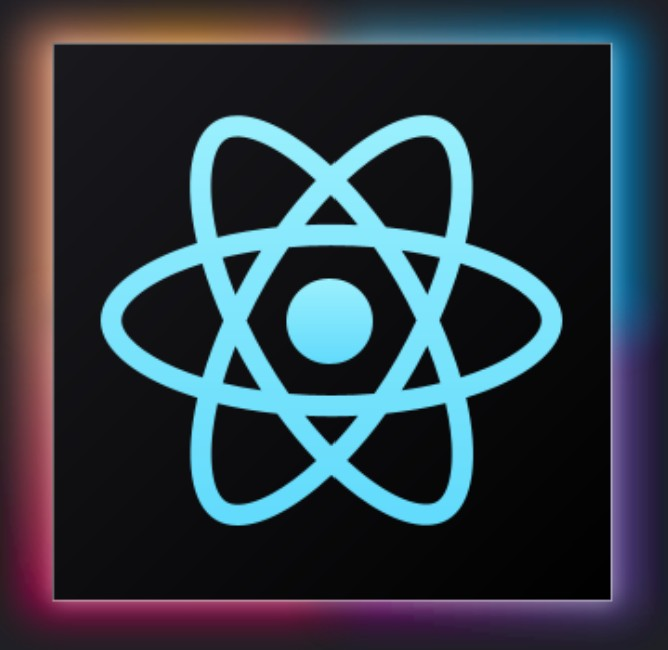

---

My name is `Kevin Roozrokh`.  
Welcome to my  ReadMe. 
 
Founder of  
 
https://github.com/StrawHatAI/
 
Straw Hat Enterprise AI's mission is to invent and support novel turn-key enterprise AI solutions for mission critical operations.

Straw Hat Enterprise AI's vision is to build a future where AI serves as a force for good, unlocking human potential by solving the world's most pressing challenges creating a more equitable and sustainable future for all.
  
Straw Hat Enterprise AI's senior software engineering team is open to `Collaborations` / `Partnerships` / `CTO` / `principal` / `senior level` software engineering `contract work`.  
`Non-negotiable` - Your project, cause, team and/or organization must adhere to a high level of ethics and integrity. 
To request a resume, email address is below.

---

#### About Me
I started coding when I was a kid, with that in mind...  
`I have 30 years of coding experience.`  

#### 📒Portfolio 
Portfolio needs updating, ask for a resume.

---

#### Coding 

AI, Crypto, Blockchain, or edge computing? Count me in.   
I have trained 100s of GPTs, MCPs and AI Agents, I can scale any business, sector is irrelevant. 
Vibe coding ninja. At times, I have up to 4 AIs coding simultaneously. 
AI can code faster than a human, but I make less mistakes when completing, and deploying finished software.  
I've tested enough language models to be certain. I tried.   
Also, I am ridiculously good at writing `patents.`  

#### ®️Patents

Patents Written = 24  
💡Patents Pending = 11  

#### Open Source Contributions
I would need pages to tell about them all, but here are 5 I am proud of.  
• Collaborated to help build the cybersecurity Linux distribution called Backtrack Linux, predecessor to Kali Linux. 
• Coded .kext files for the OSx86project project. These PC builds are now known as a hackintosh. 
• Contributed code to help build the Cardano ADA Blockchain. 
• Coded modern Bitcoin and Ethereum mining calculators. 
• Custom coded a no code ERC-20 token and ERC-721 token generator. 

---

####  Technical Skills
`Programming Languages:` JavaScript, CSS, HTML, PHP, Solidity, SQL, UNIX, Python  
`Frameworks:` React, ReactJS, React Native, Node.js, Express.js, Flutter, Vue.js, TypeScript  
`Artificial Intelligence:` OpenAI ChatGPT API, Google Gemini API, Meta Llama, DeepSeek R1, Claude, Perplexity 
`Machine Learning Models:` TensorFlow, PyTorch, NLP, Computer Vision, Deep Learning, LLMOps  
`Cloud Platforms:` AWS, Google Cloud, Firebase, DynamoDB, MongoDB  
`Blockchain:` Smart Contracts, Web3, Bitcoin/Ethereum Mining, IPFS, Ganache  
`Operating Systems:` Linux, Windows Server, MacOS, Android, iOS  
`Certifications:` ITIL v3, CSM, A+, Network+, Security+   

---

#### 🏛️Recent Education  

`HarvardX` - Harvard University  
CS50 Computer Science, CS50W Web Programming, CS50M Mobile Apps, CS50AI Artificial Intelligence with Python

`MIT OpenCourseWare` - Massachusetts Institute of Technology 
6.006 Intro to Algorithms, 6.046J Design and Analysis of Algorithms, 6.851 Advanced Data Structures, 6.854 Advanced Algorithms, 6.890 Algorithmic Lower Bounds   

---

#### 🌐Socials 

---

#### ✉️<a href="RoozrokhK@Gmail.com">Contact Email</a>

----

#### Why You Should Hire Me
My expertise makes banks and companies wealthy. Very wealthy. Simple as that. 

<!--
**KevinRoozrokh/KevinRoozrokh** is a ✨ _special_ ✨ repository because its `README.md` (this file) appears on your GitHub profile.

Here are some ideas to get you started:

- 🔭 I’m currently working on ...
- 🌱 I’m currently learning ...
- 👯 I’m looking to collaborate on ...
- 🤔 I’m looking for help with ...
- 💬 Ask me about ...
- 📫 How to reach me: ...
- 😄 Pronouns: ...
- ⚡ Fun fact: ...
-->
